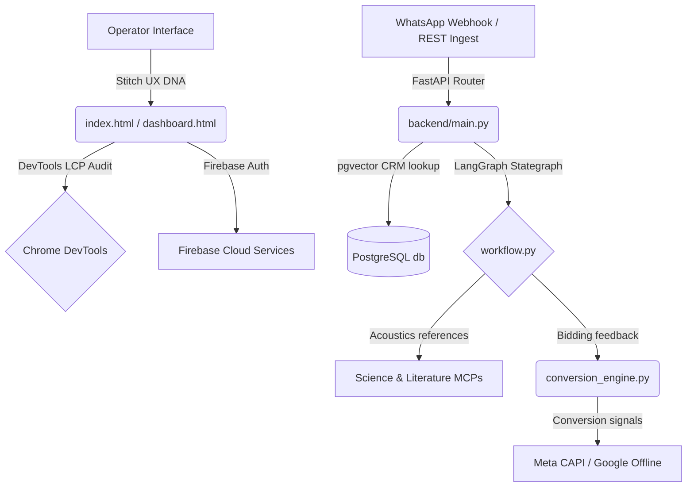

# Antigravity AI - System Skills & Plugins Adoption Manual

This manual documents the architectural integration and tactical adoption of system plugins, Model Context Protocol (MCP) server nodes, and diagnostic tools within the **Antigravity AI** multi-agent marketing operating system. It organizes our structural capabilities and provides guidelines on when and how each component is leveraged to drive the Rhythm Academy operational workflows.

---

## 1. UX & Visual Architecture (Stitch UI/UX Plugin)
The visual frontends (`index.html` and `dashboard.html`) adopt the premium styling principles defined by **Stitch UI/UX Pro**:
- **Design DNA**: Glassmorphic blur panels (`backdrop-filter: blur(14px)`), deep matte dark surfaces (`#030307`), harmonized tailored color palettes (electric cyan for active nodes, neon magenta for rendering pipelines), and micro-animations (glowing pulses, flowing edge dashings).
- **Adoption Standard**: Any new dashboard viewports, metrics modules, or control panels *must* strictly adhere to the HSL tokens and visual styling conventions embedded in the frontend app shell to maintain a cinematic, premium look and feel.

---

## 2. In-Browser Audits & Performance Diagnostics (Chrome DevTools Plugin)
To guarantee smooth, enterprise-grade user interactions under continuous live event loops:
- **debug-optimize-lcp**: Used to profile and audit Largest Contentful Paint (LCP) times on the dashboard shell. The canvas renders within `< 0.8s` by loading Tailwind and script elements asynchronously.
- **a11y-debugging**: Assures semantic accessibility (ARIA labels, high-contrast text contrast over dark backdrops, keyboard event mappings) matching standard web.dev guidelines.
- **memory-leak-debugging**: Monitored regularly to prevent memory allocation overflows caused by infinite setInterval logging loops (`pushSystemEvent`, `prependLogSim`). The frontends restrict active arrays to a max of `30` rows to clear cache.

---

## 3. Storage, Auth & Cloud Scalability (Firebase Plugin)
For production-grade scalability, we utilize **Firebase** as our cloud integration framework:
- **firebase-auth-basics**: Establishes secure sign-in flows. The login overlay simulates a Google Workspace accounts verification that easily connects to Firebase Auth APIs for rhythm-academy.com administrators.
- **firebase-firestore & firebase-security-rules-auditor**: Standardizes NoSQL leads and split fee payment records storage. Enforces strict write rules where students can only view their own payment ledger balances.
- **firebase-data-connect**: Provides relational SQL capabilities inside our cloud backend nodes to match prospects directly to faculty schedules.

---

## 4. Multi-Agent Cognitive Intelligence (Science & Literature MCPs)
To build a highly intelligent Content Agent capable of writing precise scientific and technical course copy for Rhythm Academy (Music Production, Audio Engineering, Acoustic Science):
- **literature-search-openalex & pubmed-database**: Evaluates and fetches academic references on acoustics, sound synthesis, and multiple-speaker phase alignments.
- **workflow-skill-creator**: Packages successful multi-agent trajectories (e.g. Inbound lead captured -> direct callback scheduled -> Studio Visit conversion -> Meta CAPI signal) into a reusable platform template, enabling easy scaling to other academy divisions.

---

## 5. Summary Plugins & MCP Mappings

